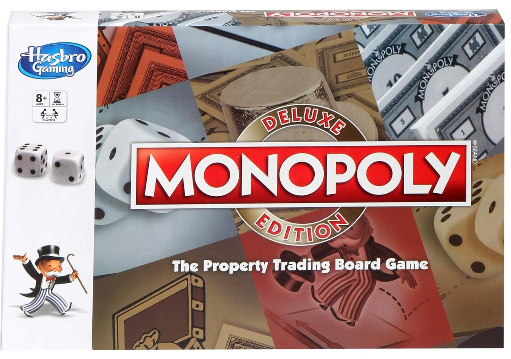

# Hasbro Monopoly Deluxe Edition Board




A digital assistant app for managing the **Hasbro Monopoly Deluxe Edition** board game. This app helps streamline manual tasks like:

- Managing player money and transactions 💰
- Assigning property ownership 🏠
- Drawing Chance and Community Chest cards 🎴

## 💻 Tech Stack
- React.js
- Tailwind CSS
- localStorage (for data persistence)

## 🚀 Features
- Add/remove players with automatic balance tracking
- Transfer money between players or to/from the bank
- Track owned properties and mortgage status
- Simulate drawing random cards from Chance/Community Chest

## 🛠️ Setup

```bash
git clone https://github.com/your-username/monopoly-companion.git
cd monopoly-companion
npm install
npm start
